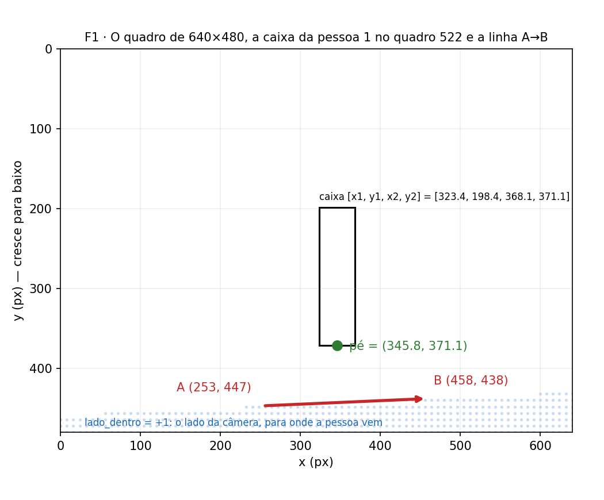
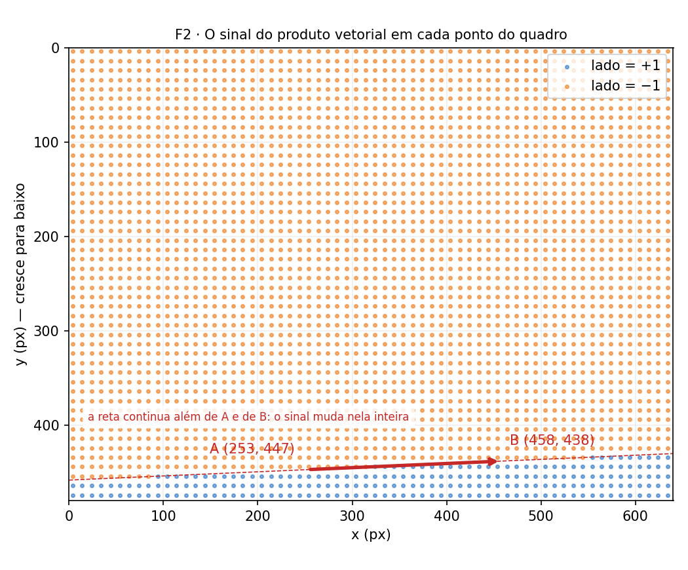
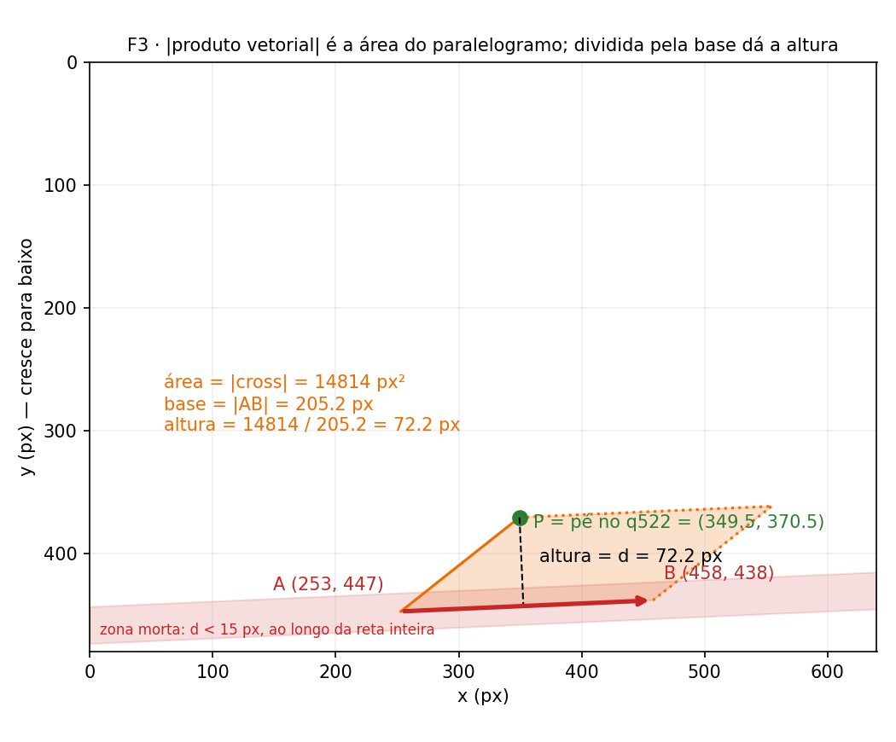
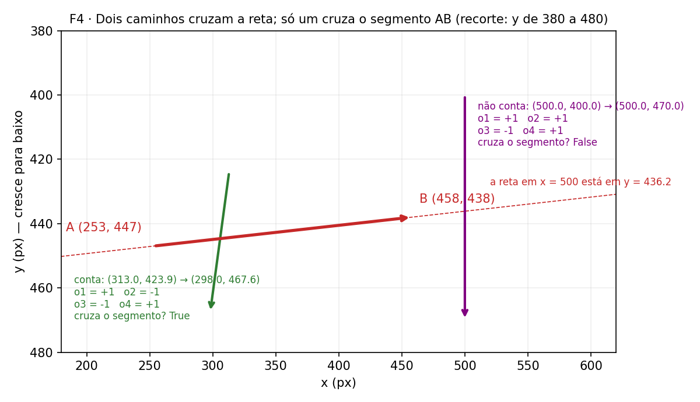
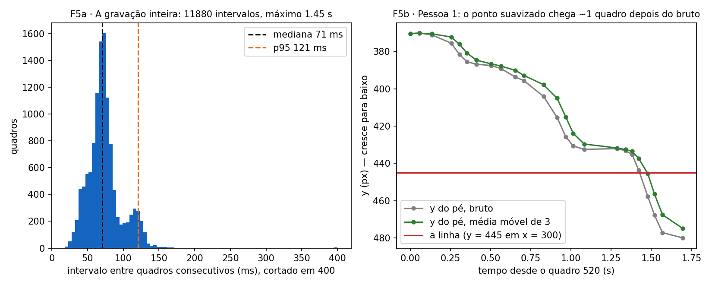
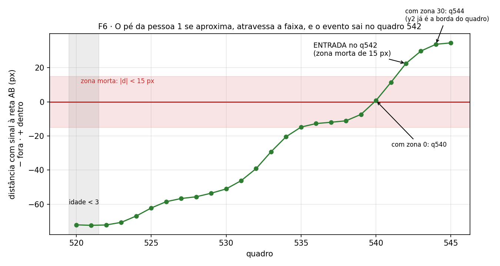

# A geometria do Limiar

### Como um produto vetorial decide se uma pessoa entrou ou saiu

*Material de estudo. Todos os números vêm de uma gravação real da entrada da faculdade (3 de setembro de 2026) e são reproduzidos pelos scripts que acompanham este texto.*

---

## O que este texto cobre

O **Limiar** é um sistema que conta quantas pessoas entram e saem pela porta da faculdade a partir de uma câmera. Ele registra só três coisas por passagem: a porta, o instante e a direção. Não há imagem gravada, não há rosto, não há identidade.

Por dentro, o sistema tem três partes. Duas delas são bibliotecas prontas: um detector de pessoas (YOLO), que desenha um retângulo em volta de cada pessoa em cada quadro, e um rastreador (ByteTrack), que dá a cada retângulo um número de identificação que persiste de um quadro para o outro. Nenhuma dessas duas é assunto deste texto.

A terceira parte é a que decide. Ela recebe retângulos com número e devolve "entrou" ou "saiu". É pequena, foi escrita para o projeto, não usa nenhuma biblioteca numérica, e cabe em duas ideias de álgebra linear: **o sinal de um produto vetorial** e **o módulo dele**. Este texto explica essa parte, do dado cru até a decisão.

Cada capítulo segue a mesma ordem: a ideia em uma frase, um número calculado à mão, a fórmula, o código em Python que reproduz o número, e uma figura. Os blocos de Python rodam com o arquivo `exemplos.py` desta pasta; os vetores estão no topo dele e podem ser trocados.

---

## 1. O que o contador enxerga

**A ideia em uma frase:** o contador nunca vê uma imagem; ele vê uma tabela de números, e precisa decidir com ela.

Abaixo estão os 24 primeiros quadros em que a pessoa 1 apareceu na gravação. Cada linha é um quadro: o número dele, a hora em que chegou ao computador, os quatro cantos do retângulo que o detector desenhou (`x1, y1` é o canto superior esquerdo, `x2, y2` o inferior direito) e a confiança do detector.

| q | t (hora local) | x1 | y1 | x2 | y2 | conf. | altura da caixa |
|---|---|---|---|---|---|---|---|
| 520 | 14:53:26.855 | 331.9 | 205.0 | 374.4 | 370.4 | 0.76 | 165.4 |
| 521 | 14:53:26.912 | 327.7 | 200.7 | 371.3 | 370.0 | 0.814 | 169.3 |
| 522 | 14:53:26.991 | 323.4 | 198.4 | 368.1 | 371.1 | 0.853 | 172.7 |
| 523 | 14:53:27.111 | 318.0 | 199.0 | 364.5 | 375.5 | 0.877 | 176.5 |
| 524 | 14:53:27.161 | 315.8 | 199.7 | 364.5 | 381.6 | 0.866 | 181.9 |
| 525 | 14:53:27.209 | 314.4 | 200.0 | 364.9 | 385.5 | 0.872 | 185.5 |
| 526 | 14:53:27.268 | 311.2 | 199.1 | 362.9 | 386.8 | 0.863 | 187.7 |
| 527 | 14:53:27.358 | 306.2 | 198.2 | 358.7 | 387.5 | 0.858 | 189.3 |
| 528 | 14:53:27.419 | 300.6 | 198.0 | 353.8 | 389.1 | 0.878 | 191.1 |
| 529 | 14:53:27.510 | 295.7 | 198.2 | 350.6 | 393.7 | 0.876 | 195.5 |
| 530 | 14:53:27.562 | 291.9 | 199.2 | 347.6 | 395.6 | 0.87 | 196.4 |
| 531 | 14:53:27.685 | 287.6 | 200.3 | 345.9 | 404.1 | 0.867 | 203.8 |
| 532 | 14:53:27.768 | 283.9 | 201.9 | 345.3 | 415.3 | 0.87 | 213.4 |
| 533 | 14:53:27.822 | 281.0 | 202.9 | 345.2 | 425.7 | 0.873 | 222.8 |
| 534 | 14:53:27.869 | 278.4 | 202.8 | 344.4 | 430.7 | 0.887 | 227.9 |
| 535 | 14:53:27.938 | 276.6 | 202.9 | 343.6 | 432.5 | 0.895 | 229.6 |
| 536 | 14:53:28.141 | 274.7 | 203.0 | 342.2 | 432.1 | 0.889 | 229.1 |
| 537 | 14:53:28.195 | 272.6 | 202.8 | 340.9 | 433.2 | 0.88 | 230.4 |
| 538 | 14:53:28.235 | 269.9 | 202.7 | 339.5 | 435.3 | 0.909 | 232.6 |
| 539 | 14:53:28.277 | 265.9 | 203.7 | 338.1 | 443.7 | 0.89 | 240.0 |
| 540 | 14:53:28.333 | 261.7 | 205.2 | 337.9 | 457.8 | 0.898 | 252.6 |
| 541 | 14:53:28.374 | 258.9 | 206.8 | 337.5 | 467.7 | 0.886 | 260.9 |
| 542 | 14:53:28.424 | 255.6 | 208.4 | 336.4 | 477.2 | 0.906 | 268.8 |
| 543 | 14:53:28.551 | 252.2 | 208.6 | 334.2 | 480.0 | 0.911 | 271.4 |

A pergunta que o resto do texto responde é: **com só isso, dá para afirmar que ela entrou, e em que quadro?**

### As convenções, antes de qualquer conta

Tudo o que vem depois depende de quatro convenções. Elas são as de qualquer imagem digital, e uma delas surpreende quem vem da física.

| Convenção | Valor neste texto |
|---|---|
| Origem | canto **superior esquerdo** do quadro |
| Eixo x | cresce para a direita, de 0 a 640 |
| Eixo y | cresce **para baixo**, de 0 a 480 |
| Unidade de posição | pixel (px). Produto vetorial sai em px², distância em px |
| `t` | instante em que o quadro **chegou ao computador**, não o instante da exposição. Fuso −03:00 |

O eixo y para baixo é o que surpreende. Na tabela, a pessoa se aproxima da câmera e o valor de `y2` sobe de 370 para 480: ela "desce" na imagem. Todas as figuras deste texto mantêm essa orientação, com o zero em cima, para que o que se vê corresponda ao que o código calcula.

### O pé

**A ideia em uma frase:** a posição da pessoa é o centro da base do retângulo, porque é o ponto dela que toca o chão.

A linha de contagem é desenhada no chão. O único ponto do retângulo que está no mesmo plano é a base. O centro do retângulo, que parece a escolha natural, se move quando a pessoa levanta o braço, quando um poste cobre a cabeça dela, ou simplesmente quando ela chega mais perto e o retângulo cresce. O pé não se move por nenhum desses motivos.

**Exemplo.** No quadro 520 o retângulo é `[331.9, 205.0, 374.4, 370.4]`. O pé é

    x = (331.9 + 374.4) / 2 = 353.15
    y = 370.4

ou seja, o ponto (353.1, 370.4).

```python
from geometria import ponto_base

caixa = (331.9, 205.0, 374.4, 370.4)   # pessoa 1, quadro 520
print(ponto_base(caixa))                # (353.15, 370.4)
```



*F1. O quadro de 640×480 com o retângulo da pessoa 1 no quadro 522, o pé em verde, e a linha de contagem A→B. A região sombreada em azul é o lado que a calibração definiu como "dentro".*

---

## 2. A linha é um vetor

**A ideia em uma frase:** a linha de contagem são dois pontos, A e B, e a ordem entre eles importa.

Na câmera da entrada, a calibração gravou:

    A = (253, 447)
    B = (458, 438)

Os dois pontos definem um vetor, **AB = B − A**:

    AB = (458 − 253, 438 − 447) = (205, −9)
    |AB| = √(205² + 9²) = √42106 ≈ 205,2 px

A linha está quase horizontal, ligeiramente inclinada, e fica perto da borda inferior do quadro (y de 438 a 447 num quadro de 480).

A ordem importa porque o vetor **AB** e o vetor **BA** apontam em sentidos opostos, e é o sentido que vai definir, no próximo capítulo, qual lado recebe sinal positivo. Para o código, "a linha de A a B" e "a linha de B a A" são duas linhas diferentes.

```python
from math import hypot

A = (253.0, 447.0)
B = (458.0, 438.0)
ab = (B[0] - A[0], B[1] - A[1])
print(ab)              # (205.0, -9.0)
print(hypot(*ab))      # 205.19...
```

---

## 3. De que lado?

**A ideia em uma frase:** o sinal de um único número diz se o pé está de um lado da linha ou do outro.

### Primeiro o número

Pegue o pé da pessoa 1 no quadro 522, depois de suavizado (capítulo 6): P = (349.5, 370.5). Monte o vetor de A até P:

    AP = P − A = (349.5 − 253, 370.5 − 447) = (96.5, −76.5)

Agora combine AB = (205, −9) e AP assim: multiplique o x de um pelo y do outro, e subtraia o produto cruzado.

    205 · (−76.5) − (−9) · 96.5
    = −15682.5 + 868.5
    = −14814

O resultado é **−14814 px²**. Negativo. Para o quadro 542, com P = (298.0, 467.6), a mesma conta dá **+4628 px²**. Positivo. Entre um quadro e outro a pessoa cruzou a linha, e o sinal trocou.

Um ponto exatamente sobre a linha, como o meio dela (355.5, 442.5), dá zero.

### A regra operacional

Ande de A até B. O que fica **à sua direita, na tela**, tem sinal positivo; o que fica à esquerda, negativo. Nesta câmera, andar de A = (253, 447) para B = (458, 438) é andar para a direita na tela, e a direita de quem anda para a direita é **para baixo** na imagem. Por isso o lado de baixo, o lado da câmera, é positivo. É o que a figura F2 mostra ponto a ponto.

### Depois o símbolo

A conta acima é a componente z do produto vetorial (B − A) × (P − A). Os dois vetores vivem no plano da imagem, que tratamos como z = 0. Um produto vetorial de dois vetores nesse plano tem as componentes x e y nulas e sobra só a componente z:

    (B − A) × (P − A) = (0, 0, (bx − ax)(py − ay) − (by − ay)(px − ax))

O sistema (x para a direita, y para baixo, z entrando na tela) é um sistema destro, o padrão em visão computacional. A regra da mão direita vale nele sem alteração: com os dedos indo de AB para AP, o polegar aponta **para dentro da tela** quando o resultado é positivo e para fora quando é negativo. O que muda em relação ao quadro-negro é só para onde "dentro da tela" fica, e é por isso que a regra operacional acima é mais segura do que a mão.

### Por que o lado "de dentro" é medido, e não deduzido

O código guarda, por câmera, um número chamado `lado_dentro`: +1 ou −1. Ele diz qual sinal corresponde ao interior do prédio. Na câmera da entrada é +1. Em todas as outras câmeras do projeto é −1.

Não dá para deduzir esse número da geometria, porque ele depende da ordem em que o instalador clicou A e B na calibração. Se alguém recalibrar clicando B primeiro, o vetor inverte, todos os sinais invertem, e o mesmo pé que dava +4628 passa a dar −4628. O `lado_dentro` é, portanto, uma **medição feita na instalação**, gravada junto com a linha, e não uma propriedade da porta.

```python
from geometria import produto_vetorial, lado

A = (253.0, 447.0)
B = (458.0, 438.0)

for p in [(349.5, 370.5), (302.2, 445.6), (298.0, 467.6), (355.5, 442.5)]:
    print(p, produto_vetorial(A, B, p), lado(A, B, p))
# (349.5, 370.5)  -14814.0  -1     quadro 522: fora
# (302.2, 445.6)    +156.0  +1     quadro 540: acabou de passar
# (298.0, 467.6)   +4628.0  +1     quadro 542: dentro
# (355.5, 442.5)      +0.0   0     sobre a reta

print(lado(A, B, (298.0, 467.6)), lado(B, A, (298.0, 467.6)))   # 1  -1
```

O código de produção, tal como está no projeto:

```python
def produto_vetorial(a, b, p):
    """Componente z do produto vetorial (B-A) x (P-A)."""
    return (b[0] - a[0]) * (p[1] - a[1]) - (b[1] - a[1]) * (p[0] - a[0])

def lado(a, b, p):
    """+1, -1 ou 0 (sobre a reta)."""
    v = produto_vetorial(a, b, p)
    if v > EPS:
        return 1
    if v < -EPS:
        return -1
    return 0
```

`EPS` vale 10⁻⁹ e serve só para tratar empates exatos de ponto flutuante. Não é uma tolerância de medida. O ruído de medição, que é de pixels e não de bilionésimos, é tratado no capítulo seguinte.



*F2. O sinal do produto vetorial em cada ponto do quadro. A reta que contém A e B separa o quadro inteiro, inclusive além das pontas do segmento.*

---

## 4. A que distância?

**A ideia em uma frase:** o mesmo número, sem o sinal, é a área de um paralelogramo, e área dividida por base é altura.

O módulo do produto vetorial de dois vetores é a área do paralelogramo que eles formam. Para AB e AP do quadro 522 essa área é 14814 px². A base do paralelogramo é |AB| = 205,2 px. A altura é

    14814 / 205,2 = 72,2 px

e a altura de um paralelogramo com base sobre a reta AB é exatamente a distância perpendicular de P a essa reta. Um único produto vetorial responde duas perguntas: o sinal diz **de que lado**, o módulo diz **a que distância**.

A distância é à **reta** que passa por A e B, não ao segmento. Um ponto sobre o prolongamento da reta, muito além de B, tem distância zero. Isso importa para o que vem a seguir.

### A zona morta

O detector não devolve a mesma caixa duas vezes. De um quadro para o outro o retângulo oscila alguns pixels, mesmo com a pessoa parada. Se a pessoa para em cima da linha, o sinal do produto vetorial troca várias vezes por segundo, e um contador ingênuo dispara em série.

A solução do Limiar é uma faixa de 15 px para cada lado da reta, dentro da qual **nenhuma decisão é tomada**. Enquanto o pé está a menos de 15 px da reta, o contador espera. Ele não perde o cruzamento: a pessoa vai sair da faixa por um lado ou pelo outro, e é aí que se decide.

Dois detalhes que um físico vai reconhecer:

- A faixa sozinha não é uma histerese. O que faz a histerese é a faixa **mais uma memória**: o contador guarda o último lado em que viu o pé fora da faixa (`lado_confirmado`) e onde o pé estava nesse momento (a âncora). É a mesma estrutura de um Schmitt trigger: duas soglias e um estado.
- Como a distância é à reta inteira, a faixa também se estende pelo prolongamento. Quem anda ao longo dessa extensão, fora da porta, fica "em espera" indefinidamente. Não é contado, o que é o comportamento certo, mas por um motivo diferente do que se poderia supor.

**Exemplo.** Quadro 540, pé suavizado P = (302.2, 445.6):

    cross = 205 · (445.6 − 447) − (−9) · (302.2 − 253) = −287 + 442.8 = +155.8 px²
    d = 155.8 / 205.2 = 0.76 px

O sinal já é positivo, a pessoa já está do lado de dentro, mas 0,76 px é menos que 15 px. Decisão adiada; `lado_confirmado` continua −1.

```python
from geometria import produto_vetorial, distancia_ponto_reta

A = (253.0, 447.0)
B = (458.0, 438.0)

print(distancia_ponto_reta((349.5, 370.5), A, B))   # 72.19  quadro 522
print(distancia_ponto_reta((302.2, 445.6), A, B))   # 0.76   quadro 540: dentro da zona morta
print(distancia_ponto_reta((600.0, 431.8), A, B))   # 0.03   além de B, sobre o prolongamento
```

```python
def distancia_ponto_reta(p, a, b):
    """Distância perpendicular de P à reta AB, em pixels."""
    comprimento = hypot(b[0] - a[0], b[1] - a[1])
    if comprimento < EPS:
        return hypot(p[0] - a[0], p[1] - a[1])   # A e B coincidem: não há reta
    return abs(produto_vetorial(a, b, p)) / comprimento
```



*F3. O paralelogramo formado por AB e AP no quadro 522. A área é o módulo do produto vetorial; a altura tracejada é a distância à reta. A faixa vermelha é a zona morta, que acompanha a reta inteira.*

---

## 5. Segmento, não reta

**A ideia em uma frase:** trocar de lado da reta não basta; o caminho precisa ter cruzado o pedaço de reta que é a porta.

A reta que contém A e B corta o quadro inteiro. Alguém que passa à direita de B, fora da porta, também troca de lado da reta, e um contador que só olhasse o sinal contaria essa pessoa. O que se quer é saber se o deslocamento da pessoa cruzou o **segmento** AB.

### Quatro testes de lado

Dois segmentos, P1P2 e AB, se cruzam quando cada um separa as pontas do outro. Isso são quatro chamadas da função `lado`:

    o1 = lado(P1, P2, A)     A está de que lado do caminho?
    o2 = lado(P1, P2, B)     e B?
    o3 = lado(A, B, P1)      P1 está de que lado da porta?
    o4 = lado(A, B, P2)      e P2?

Os segmentos se cruzam se `o1 ≠ o2` **e** `o3 ≠ o4`. A primeira condição diz que a porta atravessa o caminho; a segunda, que o caminho atravessa a porta. Precisa das duas.

**Exemplo 1, o caminho que conta.** Da âncora do quadro 534, (313.0, 423.9), ao pé do quadro 542, (298.0, 467.6):

    o1 = +1   o2 = −1   →  diferentes: a porta separa as pontas do caminho
    o3 = −1   o4 = +1   →  diferentes: o caminho separa as pontas da porta
    cruza o segmento: sim

**Exemplo 2, o caminho que não conta.** Uma pessoa desce em linha reta em x = 500, de (500, 400) a (500, 470). A reta AB, nesse x, está em y = 436,2, então o caminho cruza a reta.

    o1 = +1   o2 = +1   →  iguais: A e B estão do mesmo lado do caminho
    o3 = −1   o4 = +1
    cruza o segmento: não

A pessoa passou à direita de B, fora da porta. Trocou de lado da reta, mas não cruzou o segmento.

O caso em que um dos quatro testes dá zero (um ponto exatamente sobre o outro segmento) é tratado à parte no código, com uma verificação de caixa envolvente. Ele nunca ocorre na prática por causa da zona morta, mas o código o cobre para ser correto em qualquer entrada.

```python
from geometria import lado, segmentos_se_cruzam

A = (253.0, 447.0)
B = (458.0, 438.0)

for p1, p2 in [((313.0, 423.9), (298.0, 467.6)), ((500.0, 400.0), (500.0, 470.0))]:
    print(lado(p1, p2, A), lado(p1, p2, B), lado(A, B, p1), lado(A, B, p2),
          segmentos_se_cruzam(p1, p2, A, B))
# 1 -1 -1 1 True
# 1  1 -1 1 False
```

```python
def segmentos_se_cruzam(p1, p2, a, b):
    o1 = lado(p1, p2, a)
    o2 = lado(p1, p2, b)
    o3 = lado(a, b, p1)
    o4 = lado(a, b, p2)
    if o1 != o2 and o3 != o4:
        return True
    # casos colineares: o ponto toca o segmento sem atravessá-lo
    if o1 == 0 and _no_retangulo(p1, a, p2): return True
    if o2 == 0 and _no_retangulo(p1, b, p2): return True
    if o3 == 0 and _no_retangulo(a, p1, b):  return True
    if o4 == 0 and _no_retangulo(a, p2, b):  return True
    return False
```



*F4. Recorte da região da porta. O caminho verde cruza o segmento e conta. O roxo cruza a reta tracejada, mas passa à direita de B e não conta.*

---

## 6. Tempo, ruído e três filtros

**A ideia em uma frase:** cada filtro do contador existe para um erro que foi observado, e os três são simples.

### O tempo não é uniforme

A câmera é anunciada a 25 quadros por segundo. Na gravação inteira, medindo o intervalo entre quadros consecutivos que chegaram ao computador:

| Grandeza | Valor |
|---|---|
| Intervalos medidos | 11 880 |
| Mediana | 71 ms |
| Percentil 95 | 121 ms |
| Máximo | 1,45 s |
| Taxa efetiva | 13,6 quadros/s |

Na própria tabela da pessoa 1, entre os quadros 535 e 536 passaram 203 ms. A câmera envia por Wi-Fi, o computador recebe quando pode, e `t` é a hora de chegada. Dois dos três filtros abaixo contam em quadros, e um quadro vale de 40 ms a 1,4 s. É um ponto que este texto não esconde.

### Filtro 1: média móvel de 3 quadros

O pé usado nas decisões não é o pé bruto do quadro, e sim a média dos últimos três. Isso tira boa parte da oscilação do retângulo.

**Exemplo.** Os pés brutos dos quadros 539, 540 e 541 são (302.0, 443.7), (299.8, 457.8) e (298.2, 467.7). A média é (300.0, 456.4), e é esse o ponto suavizado do quadro 541.

O preço é um atraso de cerca de um quadro. No quadro 540 o pé bruto já está 12 px além da linha e o suavizado ainda está em cima dela (F5b). Todas as figuras deste texto que mostram o ponto suavizado mostram o bruto junto.

```python
pes = [(302.0, 443.7), (299.8, 457.8), (298.2, 467.7)]
media = (sum(p[0] for p in pes) / 3, sum(p[1] for p in pes) / 3)
print(media)   # (300.0, 456.4)
```

### Filtro 2: idade mínima de 3 quadros

Um rastro que existe há menos de três quadros não decide nada. Isso elimina detecções de um quadro só (um reflexo, uma sombra que o detector achou que era gente) e evita decidir com uma única posição, antes que a média móvel tenha três pontos.

### Filtro 3: cooldown de 1,5 s

Depois de contar, o mesmo rastro fica 1,5 s sem poder contar de novo. O erro que ele trata é a hesitação: a pessoa que dá um passo para dentro, um para fora, e entra. Sem o cooldown seriam três eventos. Com ele, um.

O cooldown conta em segundos, não em quadros. É o único dos três filtros que não depende da taxa de chegada.



*F5. À esquerda, o histograma dos intervalos entre quadros na gravação inteira. À direita, o y do pé da pessoa 1, bruto e suavizado, contra o tempo: o suavizado chega à linha cerca de um quadro depois.*

---

## 7. A máquina inteira, quadro a quadro

**A ideia em uma frase:** a cada quadro o contador faz seis perguntas, na mesma ordem, e para na primeira que responde.

Para cada rastro, a cada quadro:

1. Calcule o pé, junte à trajetória, calcule o pé suavizado.
2. **Idade < 3?** Não decide. Fim.
3. **Distância à reta < 15 px?** Zona morta. Não decide. Fim.
4. **Ainda não há lado confirmado?** Grave o lado atual e o ponto atual como âncora. Fim.
5. **Lado atual é igual ao confirmado?** Avance a âncora para o ponto atual. Fim.
6. **Trocou de lado.** A corda da âncora até o ponto atual cruza o segmento AB? E o rastro não está em cooldown? Se as duas coisas, conte: ENTRADA se o lado atual é `lado_dentro`, SAÍDA se não. Em qualquer caso, atualize o lado confirmado e a âncora.

A direção é decidida pelo lado **de chegada**: `lado_atual == lado_dentro` é entrada.

Um detalhe que faz diferença: a corda testada no passo 6 vai da **âncora** até o ponto atual, e a âncora foi fixada no último quadro fora da zona morta. Não é a corda entre dois quadros consecutivos. É isso que permite a uma pessoa rápida atravessar a faixa inteira em um quadro sem que o cruzamento se perca.

### A pessoa 1, quadro a quadro

A tabela abaixo é a saída de `python demo.py`. As colunas "lado conf." e "âncora" mostram o estado **antes** de o quadro ser processado, para que se veja qual âncora foi usada em cada decisão. `Δt` é o tempo desde o quadro 520.

| q | Δt (ms) | pé bruto | pé suavizado | cross (px²) | d (px) | lado | idade | lado conf. (antes) | âncora (antes) | decisão |
|---|---|---|---|---|---|---|---|---|---|---|
| 520 | 0 | (353.1, 370.4) | (353.1, 370.4) | -14802 | 72.1 | -1 | 1 | — | — | idade<3 |
| 521 | 58 | (349.5, 370.0) | (351.3, 370.2) | -14859 | 72.4 | -1 | 2 | — | — | idade<3 |
| 522 | 136 | (345.8, 371.1) | (349.5, 370.5) | -14814 | 72.2 | -1 | 3 | — | — | confirma |
| 523 | 256 | (341.2, 375.5) | (345.5, 372.2) | -14502 | 70.7 | -1 | 4 | -1 | (349.5, 370.5) | mesmo_lado |
| 524 | 306 | (340.1, 381.6) | (342.4, 376.1) | -13737 | 66.9 | -1 | 5 | -1 | (345.5, 372.2) | mesmo_lado |
| 525 | 354 | (339.6, 385.5) | (340.3, 380.9) | -12771 | 62.2 | -1 | 6 | -1 | (342.4, 376.1) | mesmo_lado |
| 526 | 413 | (337.0, 386.8) | (338.9, 384.6) | -12012 | 58.5 | -1 | 7 | -1 | (340.3, 380.9) | mesmo_lado |
| 527 | 504 | (332.4, 387.5) | (336.4, 386.6) | -11632 | 56.7 | -1 | 8 | -1 | (338.9, 384.6) | mesmo_lado |
| 528 | 564 | (327.2, 389.1) | (332.2, 387.8) | -11423 | 55.7 | -1 | 9 | -1 | (336.4, 386.6) | mesmo_lado |
| 529 | 655 | (323.1, 393.7) | (327.6, 390.1) | -10993 | 53.6 | -1 | 10 | -1 | (332.2, 387.8) | mesmo_lado |
| 530 | 708 | (319.8, 395.6) | (323.4, 392.8) | -10478 | 51.1 | -1 | 11 | -1 | (327.6, 390.1) | mesmo_lado |
| 531 | 830 | (316.8, 404.1) | (319.9, 397.8) | -9484 | 46.2 | -1 | 12 | -1 | (323.4, 392.8) | mesmo_lado |
| 532 | 914 | (314.6, 415.3) | (317.0, 405.0) | -8034 | 39.2 | -1 | 13 | -1 | (319.9, 397.8) | mesmo_lado |
| 533 | 968 | (313.1, 425.7) | (314.8, 415.0) | -5997 | 29.2 | -1 | 14 | -1 | (317.0, 405.0) | mesmo_lado |
| 534 | 1014 | (311.4, 430.7) | (313.0, 423.9) | -4195 | 20.4 | -1 | 15 | -1 | (314.8, 415.0) | mesmo_lado |
| 535 | 1083 | (310.1, 432.5) | (311.5, 429.6) | -3033 | 14.8 | -1 | 16 | -1 | (313.0, 423.9) | zona_morta |
| 536 | 1286 | (308.4, 432.1) | (310.0, 431.8) | -2610 | 12.7 | -1 | 17 | -1 | (313.0, 423.9) | zona_morta |
| 537 | 1340 | (306.8, 433.2) | (308.4, 432.6) | -2453 | 12.0 | -1 | 18 | -1 | (313.0, 423.9) | zona_morta |
| 538 | 1381 | (304.7, 435.3) | (306.6, 433.5) | -2278 | 11.1 | -1 | 19 | -1 | (313.0, 423.9) | zona_morta |
| 539 | 1422 | (302.0, 443.7) | (304.5, 437.4) | -1505 | 7.3 | -1 | 20 | -1 | (313.0, 423.9) | zona_morta |
| 540 | 1479 | (299.8, 457.8) | (302.2, 445.6) | +155 | 0.8 | +1 | 21 | -1 | (313.0, 423.9) | zona_morta |
| 541 | 1520 | (298.2, 467.7) | (300.0, 456.4) | +2350 | 11.5 | +1 | 22 | -1 | (313.0, 423.9) | zona_morta |
| 542 | 1570 | (296.0, 477.2) | (298.0, 467.6) | +4621 | 22.5 | +1 | 23 | -1 | (313.0, 423.9) | evento → **ENTRADA** |
| 543 | 1696 | (293.2, 480.0) | (295.8, 475.0) | +6118 | 29.8 | +1 | 24 | +1 | (298.0, 467.6) | mesmo_lado |

O que a tabela mostra:

- **Quadros 520 e 521:** idade menor que 3. Nada é decidido.
- **Quadro 522:** primeira decisão possível. O pé está a 72 px da reta, do lado −1. Esse lado é confirmado e o ponto vira âncora.
- **Quadros 523 a 534:** a pessoa se aproxima, sempre do lado −1. A âncora avança a cada quadro. No 534 ela é fixada em (313.0, 423.9), a 20,4 px da reta.
- **Quadros 535 a 541:** zona morta. Sete quadros, cerca de meio segundo, em que o pé está a menos de 15 px da reta. No quadro 540 o sinal já trocou (+155 px²), mas a distância é 0,8 px e a decisão espera. A âncora **não** se move nesses sete quadros.
- **Quadro 542:** o pé sai da faixa do lado +1, a 22,5 px. Lado diferente do confirmado. A corda vai da âncora (313.0, 423.9) até (298.0, 467.6): oito quadros de deslocamento, e ela cruza o segmento (é o Exemplo 1 do capítulo 5). Não há cooldown. Lado +1 é `lado_dentro`. **ENTRADA.**
- **Quadro 543:** y2 = 480,0. O pé chegou à borda do quadro. Daqui em diante a base do retângulo é a borda, não o pé.

### O experimento: mudar a zona morta

Rodando a mesma trajetória com outras larguras de faixa, o evento sai em quadros diferentes:

| zona morta | evento |
|---|---|
| 0 px | ENTRADA no quadro 540 |
| 15 px (padrão) | ENTRADA no quadro 542 |
| 30 px | ENTRADA no quadro 544 |

A zona morta muda o **quando**, não o **se**. Com 30 px a decisão é tomada no quadro 544, quando y2 já é 480 há dois quadros: o ponto que decidiu é a borda do quadro, não o pé. Esses três números são as verificações que `demo.py` faz ao terminar, e são os mesmos que o código de produção dá.



*F6. A distância com sinal do pé suavizado à reta, quadro a quadro. Negativo é fora, positivo é dentro. A faixa é a zona morta. O evento sai no primeiro quadro fora da faixa do lado de dentro.*

### O mesmo mecanismo numa trajetória inventada

Para ver a máquina sem os dados reais, `exemplos.py` roda seis quadros inventados a cada 0,1 s, com o pé descendo 20 px por quadro:

```python
from contador import Contador

A, B = (253.0, 447.0), (458.0, 438.0)
c = Contador(A, B, lado_dentro=1)
trajetoria = [
    (520, 0.0, (330.0, 200.0, 370.0, 380.0)),
    (521, 0.1, (328.0, 200.0, 368.0, 400.0)),
    (522, 0.2, (326.0, 200.0, 366.0, 420.0)),
    (523, 0.3, (324.0, 200.0, 364.0, 440.0)),
    (524, 0.4, (322.0, 200.0, 362.0, 460.0)),
    (525, 0.5, (320.0, 200.0, 360.0, 480.0)),
]
for q, t, caixa in trajetoria:
    r = c.passo(q, t, caixa)
    print(q, r["suavizado"], round(r["d"], 1), r["lado"], r["motivo"], r["evento"])
print(c.eventos)   # [(525, 'ENTRADA')]
```

```
520 (350.0, 380.0) 62.7 -1 idade<3    None
521 (349.0, 390.0) 52.7 -1 idade<3    None
522 (348.0, 400.0) 42.8 -1 confirma   None
523 (346.0, 420.0) 22.9 -1 mesmo_lado None
524 (344.0, 440.0)  3.0 -1 zona_morta None
525 (342.0, 460.0) 16.9 +1 evento     ENTRADA
```

---

## 8. Exemplos trabalhados

Seis contas completas, com A = (253, 447), B = (458, 438), AB = (205, −9), |AB| ≈ 205,2 px e `lado_dentro` = +1. Cada uma vem com o Python que dá o mesmo número. As funções são as de `geometria.py` e `contador.py` desta pasta.

### 8.1 O sinal no quadro 522

P = (349.5, 370.5).

    cross = 205 · (370.5 − 447) − (−9) · (349.5 − 253)
          = 205 · (−76.5) + 9 · 96.5
          = −15682.5 + 868.5
          = −14814 px²
    lado  = −1 (fora)

```python
produto_vetorial((253.0, 447.0), (458.0, 438.0), (349.5, 370.5))   # -14814.0
```

### 8.2 Distância e zona morta

Com o resultado anterior, a distância à reta é 14814 / 205,2 = **72,2 px**. Longe da faixa.

No quadro 540, P = (302.2, 445.6):

    cross = 205 · (−1.4) + 9 · 49.2 = −287 + 442.8 = +155.8 px²
    d     = 155.8 / 205.2 = 0.76 px

Menos que 15 px: decisão adiada. O lado já é +1, mas o `lado_confirmado` continua −1 e a âncora continua a do quadro 534.

```python
distancia_ponto_reta((349.5, 370.5), A, B)   # 72.19
distancia_ponto_reta((302.2, 445.6), A, B)   # 0.76
```

### 8.3 Cruzar a reta sem cruzar o segmento

Caminho de (500, 400) a (500, 470). A reta em x = 500 está em

    y = 447 + (−9) · (500 − 253) / 205 = 447 − 10.8 = 436.2

então o caminho cruza a reta. Os quatro testes:

    o1 = lado((500,400), (500,470), A) = 0 · 47 − 70 · (−247) = +17290 → +1
    o2 = lado((500,400), (500,470), B) = 0 · 38 − 70 · (−42)  = +2940  → +1
    o3 = lado(A, B, (500,400)) = −1
    o4 = lado(A, B, (500,470)) = +1

`o1 = o2`: A e B estão do mesmo lado do caminho. **Não cruza o segmento.** A pessoa passou à direita da porta.

```python
segmentos_se_cruzam((500.0, 400.0), (500.0, 470.0), A, B)   # False
```

### 8.4 A ordem dos cliques

Suponha uma recalibração em que o instalador clicou primeiro em (458, 438) e depois em (253, 447), e `lado_dentro` ficou em +1 por engano. No quadro 542, P = (298.0, 467.6):

    ordem original:  205 · 20.6 + 9 · 45 = 4223 + 405 = +4628 px²  → lado +1 = lado_dentro → ENTRADA
    ordem invertida: −4628 px²                                      → lado −1 ≠ lado_dentro → SAÍDA

A mesma pessoa, o mesmo movimento, a direção contrária. A correção é gravar `lado_dentro = −1` junto com a linha invertida. É por isso que a calibração pede três cliques, e não dois: começo, fim, e um ponto do lado de dentro.

```python
lado((253.0, 447.0), (458.0, 438.0), (298.0, 467.6))   #  1
lado((458.0, 438.0), (253.0, 447.0), (298.0, 467.6))   # -1
```

### 8.5 Varrendo a zona morta

Com a trajetória real da pessoa 1:

| zona morta | âncora usada no evento | evento |
|---|---|---|
| 0 px | quadro 539, (304.5, 437.4) | quadro 540 |
| 15 px | quadro 534, (313.0, 423.9) | quadro 542 |
| 30 px | quadro 532, (317.0, 405.0) | quadro 544 |

Com 0 px a corda vai de (304.5, 437.4) a (302.2, 445.6); a reta em x ≈ 303 está em y ≈ 444,8, entre os dois, e o evento sai no 540. Com 30 px, todos os quadros de 533 a 543 têm d < 30, e o evento só sai no 544, com o pé suavizado em (293.1, 479.1), já colado à borda.

```python
# em demo.py
for zona in (0.0, 15.0, 30.0):
    c, _ = rodar(quadros, zona_morta_px=zona)
    print(zona, c.eventos)
# 0.0  [(540, 'ENTRADA')]
# 15.0 [(542, 'ENTRADA')]
# 30.0 [(544, 'ENTRADA')]
```

### 8.6 O cooldown é assimétrico

Uma pessoa entra em t = 0, volta para fora e entra de novo. Três cruzamentos reais do segmento. O que o contador registra depende dos intervalos:

| entra | volta | entra de novo | eventos | saldo |
|---|---|---|---|---|
| 0,00 s | 1,08 s | 2,08 s | ENTRADA, ENTRADA | +2 |
| 0,00 s | 1,58 s | 2,58 s | ENTRADA, SAÍDA | 0 |
| 0,00 s | 1,58 s | 3,16 s | ENTRADA, SAÍDA, ENTRADA | +1 |

Na primeira linha, a volta vem 1,08 s depois da entrada, dentro do cooldown de 1,5 s, e é descartada; a segunda entrada, 2,08 s depois da primeira, é contada. Duas entradas para uma pessoa que está dentro uma vez. Na segunda linha, a volta é contada, e é a reentrada, 1,0 s depois dela, que cai no cooldown. Só na terceira, com todos os intervalos acima de 1,5 s, os três cruzamentos aparecem.

O cooldown foi feito para a hesitação, em que um único cruzamento real aparece como três. Para três cruzamentos reais em menos de 3 s ele erra, de um jeito ou de outro. É uma escolha, e o número 1,5 s foi ajustado por medição, não deduzido.

```python
# em exemplos.py, função cruzamentos()
cruzamentos([(0.0, "desce"), (1.08, "sobe"), (2.08, "desce")])   # [(3, 'ENTRADA'), (11, 'ENTRADA')]
cruzamentos([(0.0, "desce"), (1.58, "sobe"), (2.58, "desce")])   # [(3, 'ENTRADA'), (7, 'SAIDA')]
cruzamentos([(0.0, "desce"), (1.58, "sobe"), (3.16, "desce")])   # [(3, 'ENTRADA'), (7, 'SAIDA'), (11, 'ENTRADA')]
```

---

## 9. Mapa para o código de produção

O que este texto chama de "o código" vive no repositório do Limiar, em `src/fluxo/contagem/`. As funções desta pasta são cópias didáticas com os mesmos nomes; `python demo.py --conferir` roda as duas versões sobre os mesmos casos e exige resultado idêntico.

| Neste texto | No projeto |
|---|---|
| `produto_vetorial`, `lado`, `distancia_ponto_reta`, `segmentos_se_cruzam`, `ponto_base` | `src/fluxo/contagem/geometria.py` (97 linhas, só `math.hypot`) |
| A máquina de estados do capítulo 7 | `src/fluxo/contagem/linha.py`, método `_processar_rastro` |
| A média móvel | `src/fluxo/contagem/trajetoria.py` |
| Os limiares (15 px, 3 quadros, 3 quadros, 1,5 s) | `config/pipeline.yaml`, seção `contagem` |
| A linha e o `lado_dentro` de cada câmera | `config/cameras.yaml` |
| Casos de borda (449 / 450 / 451 px → +1 / 0 / −1) | `tests/test_geometria.py` |
| Onde montar a câmera e onde desenhar a linha | `docs/calibracao.md` |
| Os números medidos, com as limitações | `docs/resultados.md` |

Os dados desta pasta (`pessoa1.csv`, `intervalos_ms.csv`) são extraídos de `dados/trilhas/entrada_real.jsonl`, que não é versionado no repositório por ser gravação de pessoas reais. Os CSV contêm só coordenadas e instantes.
